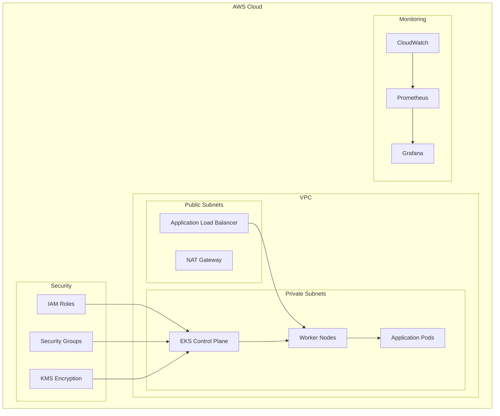

# AWS EKS Kubernetes Terraform

[](https://github.com/uldyssian-sh/aws-eks-k8s-terraform/actions)
[](https://www.terraform.io/)
[](https://aws.amazon.com/eks/)
[](https://kubernetes.io/)
[](https://github.com/uldyssian-sh/aws-eks-k8s-terraform/blob/main/LICENSE)

## Overview

Enterprise-grade AWS EKS cluster deployment using Terraform with comprehensive security, monitoring, and automation.

## Architecture



## Features

### Infrastructure
- 🏗️ **Multi-AZ VPC** with public/private subnets
- ⚙️ **EKS Managed Cluster** with latest Kubernetes
- 🔄 **Auto Scaling Groups** for worker nodes
- 🌐 **Load Balancer Controller** for ingress

### Security
- 🔐 **IAM Roles for Service Accounts (IRSA)**
- 🛡️ **KMS Encryption** for secrets and logs
- 🔒 **Security Groups** with least privilege
- 📋 **Pod Security Standards** enforcement

### Monitoring
- 📊 **Prometheus** metrics collection
- 📈 **Grafana** dashboards
- 📝 **CloudWatch** logging
- 🚨 **Alerting** and notifications

### Automation
- 🚀 **GitHub Actions** CI/CD
- 🧪 **Automated Testing** with Terratest
- 🔍 **Security Scanning** with Checkov
- 💰 **Cost Estimation** with Infracost

## Prerequisites

| Tool | Version | Purpose |
|------|---------|----------|
| [AWS CLI](https://aws.amazon.com/cli/) | >= 2.0 | AWS API access |
| [Terraform](https://www.terraform.io/) | >= 1.5 | Infrastructure provisioning |
| [kubectl](https://kubernetes.io/docs/tasks/tools/) | >= 1.29 | Kubernetes management |
| [Helm](https://helm.sh/) | >= 3.0 | Package management |

## Quick Start

### 1. Clone Repository
```bash
git clone https://github.com/uldyssian-sh/aws-eks-k8s-terraform.git
cd aws-eks-k8s-terraform
```

### 2. Configure AWS
```bash
aws configure
# Verify access
aws sts get-caller-identity
```

### 3. Deploy Infrastructure
```bash
# Check prerequisites
make check-tools

# Initialize Terraform
make init

# Deploy development environment
make apply ENV=dev

# Update kubeconfig
make kubeconfig

# Verify deployment
kubectl get nodes
```

## Configuration

### Environment Variables
```bash
export AWS_REGION="eu-central-1"
export CLUSTER_NAME="my-eks-cluster"
export ENVIRONMENT="dev"
```

### Terraform Variables
```hcl
# terraform/environments/dev/terraform.tfvars
aws_region         = "eu-central-1"
environment        = "dev"
cluster_name       = "eks-dev-cluster"
kubernetes_version = "1.29"

vpc_cidr = "10.0.0.0/16"
availability_zones = [
  "eu-central-1a",
  "eu-central-1b"
]

node_groups = {
  main = {
    instance_types = ["t3.small"]
    capacity_type  = "ON_DEMAND"
    min_size       = 1
    max_size       = 3
    desired_size   = 2
    disk_size      = 20
  }
}

enable_monitoring = false  # Cost optimization
```

## Usage Examples

### Deploy Sample Application
```bash
# Deploy nginx example
kubectl apply -f examples/nginx-deployment.yaml

# Check deployment
kubectl get pods,svc

# Access application
kubectl port-forward svc/nginx 8080:80
```

### Scale Cluster
```bash
# Scale node group
aws eks update-nodegroup-config \
  --cluster-name eks-dev-cluster \
  --nodegroup-name main \
  --scaling-config minSize=2,maxSize=5,desiredSize=3
```

### Monitor Resources
```bash
# Check cluster status
make status

# View logs
make logs

# Access monitoring
make monitoring
```

## Architecture

```
┌─────────────────────────────────────────────────────────────────┐
│                           AWS Cloud                            │
├─────────────────────────────────────────────────────────────────┤
│  ┌─────────────────────────────────────────────────────────┐    │
│  │                        VPC                              │    │
│  │  ┌─────────────────┐    ┌─────────────────────────────┐  │    │
│  │  │  Public Subnets │    │      Private Subnets        │  │    │
│  │  │                 │    │                             │  │    │
│  │  │  ┌───────────┐  │    │  ┌─────────────────────────┐│  │    │
│  │  │  │    ALB    │  │    │  │    EKS Control Plane    ││  │    │
│  │  │  └───────────┘  │    │  └─────────────────────────┘│  │    │
│  │  │                 │    │                             │  │    │
│  │  │  ┌───────────┐  │    │  ┌─────────────────────────┐│  │    │
│  │  │  │NAT Gateway│  │    │  │     Worker Nodes        ││  │    │
│  │  │  └───────────┘  │    │  │   ┌─────┐ ┌─────┐       ││  │    │
│  │  │                 │    │  │   │Pod 1│ │Pod 2│  ...  ││  │    │
│  │  └─────────────────┘    │  │   └─────┘ └─────┘       ││  │    │
│  │                         │  └─────────────────────────┘│  │    │
│  └─────────────────────────────────────────────────────────┘    │
│                                                                 │
│  ┌─────────────────┐  ┌─────────────────┐  ┌─────────────────┐ │
│  │   IAM Roles     │  │  KMS Encryption │  │   CloudWatch    │ │
│  │   & Policies    │  │   & Secrets     │  │   Monitoring    │ │
│  └─────────────────┘  └─────────────────┘  └─────────────────┘ │
└─────────────────────────────────────────────────────────────────┘
```

**Components:**
- **EKS Control Plane**: Managed Kubernetes API server
- **Worker Nodes**: EC2 instances running pods
- **ALB**: Application Load Balancer for ingress
- **NAT Gateway**: Outbound internet access for private subnets
- **IAM**: Fine-grained access control with IRSA
- **KMS**: Encryption for secrets and logs
- **CloudWatch**: Logging and monitoring

## Documentation

| Document | Description |
|----------|-------------|
| [DEPLOYMENT.md](docs/DEPLOYMENT.md) | Detailed deployment guide |
| [TROUBLESHOOTING.md](docs/TROUBLESHOOTING.md) | Common issues and solutions |
| [SECURITY.md](SECURITY.md) | Security policies and reporting |
| [FREE-TIER-OPTIMIZATION.md](FREE-TIER-OPTIMIZATION.md) | Cost optimization guide |
| [CONTRIBUTING.md](CONTRIBUTING.md) | Contribution guidelines |

## Cost Optimization

### Development Environment (~$140/month)
- Single NAT Gateway
- t3.small instances
- Minimal monitoring
- 2 availability zones

### Production Environment (~$460/month)
- Multi-AZ NAT Gateways
- Mixed instance types
- Full monitoring stack
- 3 availability zones

See [FREE-TIER-OPTIMIZATION.md](FREE-TIER-OPTIMIZATION.md) for detailed cost breakdown.

## Security

### Implemented Controls
- ✅ KMS encryption for EKS secrets
- ✅ IAM roles with least privilege
- ✅ Private worker node subnets
- ✅ Security group restrictions
- ✅ Pod security standards
- ✅ Network policies

### Security Scanning
```bash
# Run security scan
make security-scan

# Check compliance
checkov -d terraform/
```

Report security issues: [SECURITY.md](SECURITY.md)

## Testing

### Infrastructure Tests
```bash
# Run validation
make validate

# Run tests
make test

# Run integration tests
cd tests && go test -v
```

### Manual Testing
```bash
# Test connectivity
kubectl run test-pod --image=busybox --rm -it -- /bin/sh

# Test DNS resolution
nslookup kubernetes.default.svc.cluster.local
```

## Troubleshooting

### Common Issues

| Issue | Solution |
|-------|----------|
| Nodes not joining | Check IAM roles and security groups |
| Pods pending | Verify node capacity and taints |
| DNS resolution | Check CoreDNS deployment |
| Load balancer issues | Verify AWS Load Balancer Controller |

See [TROUBLESHOOTING.md](docs/TROUBLESHOOTING.md) for detailed solutions.

## Contributing

1. Fork the repository
2. Create feature branch: `git checkout -b feature/my-feature`
3. Make changes and test: `make validate test`
4. Commit changes: `git commit -m "feat: add feature"`
5. Push and create PR

See [CONTRIBUTING.md](CONTRIBUTING.md) for detailed guidelines.

## Support

- 🐛 **Bug Reports**: [Create Issue](https://github.com/uldyssian-sh/aws-eks-k8s-terraform/issues/new?template=bug_report.md)
- 💡 **Feature Requests**: [Create Issue](https://github.com/uldyssian-sh/aws-eks-k8s-terraform/issues/new?template=feature_request.md)
- 🔒 **Security Issues**: See [SECURITY.md](SECURITY.md)
- 📖 **Documentation**: [Wiki](https://github.com/uldyssian-sh/aws-eks-k8s-terraform/wiki)

## License

MIT License - see [LICENSE](LICENSE) file for details.

---

**Made with ❤️ by [uldyssian-sh](https://github.com/uldyssian-sh)**
